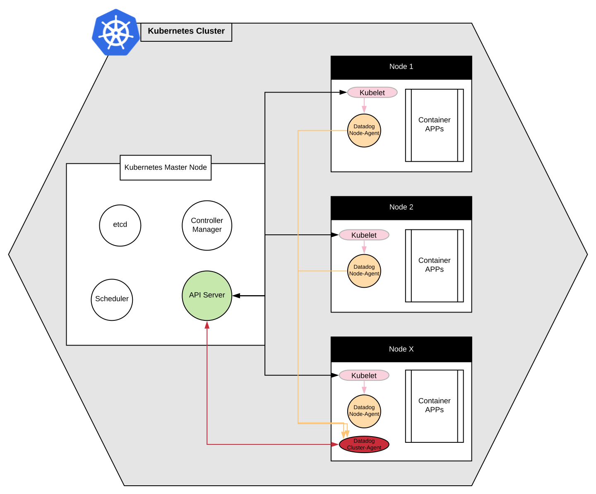

# k8s-datadog-monitoring
Monitoring Kubernetes cluster with Datadog

> More info: https://www.datadoghq.com/blog/monitoring-kubernetes-with-datadog

### Steps
The following steps will lead to build/configure
  - deploy node based Datadog agent (i.e. datadog-agent)
  - deploy cluster based Datadog agent (i.e. datadog-cluster-agent)
  - create necessary permission and secrets to establish secure communication
  - deploy kube-state-metrics which is essential component to enable cluster-level metrics reporting
  - enable logs collection (i.e. both in Kubernestes cluster-level and containerized applications)
  - document a few other knowledge

#### Diagram


0. Pre-requisite
  - Existing Kubernetes cluster. To quickly spin up one, go to [aks-playground](https://github.com/openrba/aks-playground)
  - Install Prometheus in existing Kubernetes cluster
  ```
  kubectl create namespace prometheus
  helm repo add stable https://kubernetes-charts.storage.googleapis.com
  helm install prometheus stable/prometheus -n prometheus
  ```

> Warning: Take a note from the output of previous steps. Prometheus URL may need to be set in datadog-cluster-agent.yaml unless it matched with the one already set. Typically, it should already be matched.

1. Configure Permissions and Secrets (ClusterRole, ClusterRoleBinding, ServiceAccount)
```
kubectl create -f cluster-agent-rbac.yaml
```

2. Create Kubernetes Secret to securely provide Datadog API Key
```
kubectl create secret generic datadog-secret --from-literal api-key="<YOUR_API_KEY>"
```

3. Create secrete token to enable secure Agent-to-Agent communication - i.e. cluster agent and node agent
```
echo -n '<32_CHARACTER_LONG_STRING>' | base64
```

4. Create secret token for cluster-agent and node-agent to communicate each other
```
kubectl create secret generic datadog-auth-token --from-literal=token=<TOKEN_FROM_PREVIOUS_STEP>
```

5. Deploy cluster agent 
```
kubectl apply -f datadog-cluster-agent.yaml
```

6. Verify if cluster agent was successfully installed
```
kubectl get pods -l app=datadog-cluster-agent
kubectl exec <Use pod name from the above output> -- datadog-cluster-agent status
```
> Warning: if the status showed empty in previous step, make sure prometheus_url in datadog-cluster-agent.yaml is pointing to correct URL. The URL should be the one generated when deploying Prometheus in Kubernetes cluster.

7. Deploy node agent
```
kubectl create -f datadog-agent.yaml
```

8. Verify if node agent was successfully insgalled
```
# The number of desired and current pods should be equal to the number of running nodes in your Kubernetes cluster.
kubectl get daemonset datadog-agent
# List pods
kubectl get pods -l app=datadog-agent
# Query agent status using pod name 
kubectl exec <name of pod from above command> -- agent status
```
> Warning: if nothing was reported in Datadog after executing previous step, it could be this error "Unable to detect the kubelet URL automatically". Quick workaround was to set environment variable (DD_KUBELET_TLS_VERIFY=false) in datadog-agent.yaml

9. Deploy kube-state-metrics (optional add-on required for some cluster-level metrics reporting)
```
git clone https://github.com/kubernetes/kube-state-metrics.git
cd kube-state-metrics
kubectl apply -f examples/standard

# Verify
kubectl get deploy kube-state-metrics --namespace kube-system
```

10. AutoDiscovery feature - this feature should be enabled by default in Datadog. No special configuration is needed. This feature makes it possible to continuously dicover and monitor containerized applications in the cluster as they scale and shift across containers and hosts.
For services that require user-provided configuration (such as authentication credential), use Kubernetes pod annotation.
```
annotations:
  ad.datadoghq.com/mysql.check_names: '["mysql"]'
  ad.datadoghq.com/mysql.init_configs: '[{}]'
  ad.datadoghq.com/mysql.instances: '[{"server": "%%host%%", "user": "datadog","pass": "<UNIQUEPASSWORD>"}]'
```

11. Monitoring Kubernetes with Tags - tags are essential in monitering dynamic infrastructure where host names, IP addresses and other identifiers are constantly changing. Datadog automatically imports metadata from 
 * Kubernetes
 * Docker
 * Cloud services
 * Other technologies
 
   and creates tags that can be used to sort, filter and aggregate data. Custom tags can also be added. For example, in the above node-agent configuration, the following can be added to tag custom labels.
   ```
    env:
    [...]
      - name: DD_TAGS
        value: cluster-codename:melange team:core-platform
   ```

12. Collect Logs
  * Enable logs collection from containers. In datadog-agent.yaml manifest, set the following environment variables
  ```
  env:
    [...]
      - name: DD_LOGS_ENABLED
        value: "true"
      - name: DD_LOGS_CONFIG_CONTAINER_COLLECT_ALL
        value: "true"
      - name: DD_AC_EXCLUDE
        value: "name:datadog-agent"
  ```
  In the above example, DD_AC_EXCLUDE ensured datadog-agent to omit its own logs.
  * Add the following `volumeMounts` and `volumes`
  ```
  volumeMounts:
    [...]
      - name: pointdir
        mountPath: /opt/datadog-agent/run
    [...]
  volumes:
    [...]
      - hostPath: 
          path: /opt/datadog-agent/run
        name: pointdir
  ```
  * Update cluster configuration
  ```
  kubectl apply -f datadog-agent.yaml
  ```
  * To view logs, go to https://app.datadoghq.com/logs
