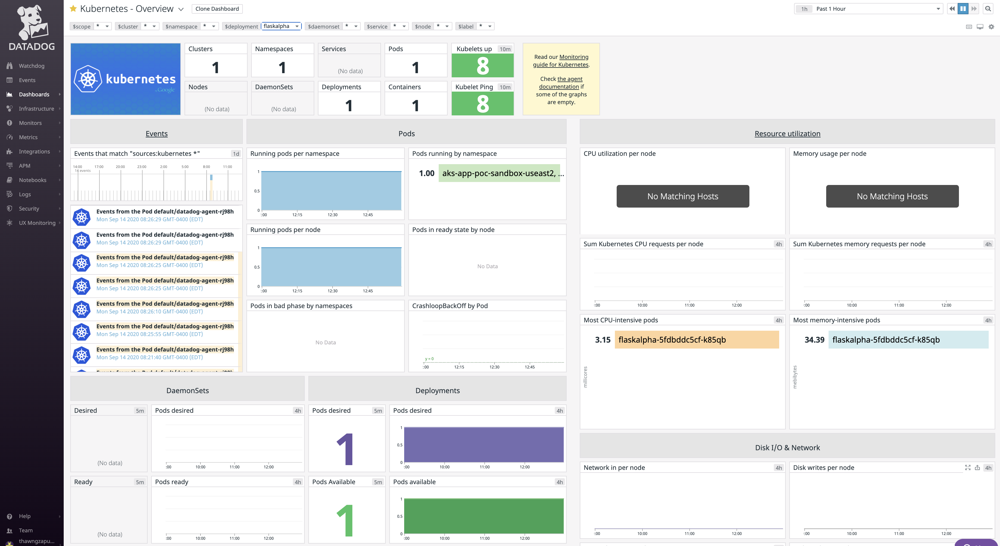

# Monitoring Containerized Python Application with Datadog
This repo contained 
 - A simple Python web application
 - Dockerfile to containerize the application
 - Helm charts for the deployment of the application and Datadog agent
 - Terraform code to release Helm charts

# Configuration required in Datadog
With Datadog autodiscovery which is enabled by default, no additional installation/configuration is required to collect container's metrics.

# Ship Application's Log File to Datadog
If it is desired to ship application's log file to Datadog, additional config is required as the following.
 - Create [configmap](../dotnet/alpha.yaml)
 - Configure [Datadog agent](../dotnet/datadog-agent.yaml) with the volume created with configmap in the previous step
 ```
 - name: vol-datadog-confd
          configMap:
            name: cm-datadog-confd
```
> Warning: log shipping to Datadog is not quite working when there are multiple nodes in k8s cluster. With a single-node cluster, the setup mentioned did work. Still investigating...

# Example
1. This example assumed an existing AKS cluster. To quickly spin up one, see [aks-playground](https://github.com/openrba/aks-playground)
2. Deploy Python app to AKS cluster
```
cd monitoring-with-datadog/python
terraform init
terraform plan
terraform apply -auto-approve
```
3. From the Terraform output in the previous step, make sure to run port-forward commands if wanting to view the app locally
4. View the app at http://localhost:5000
5. View metrics in Datadog
 - Go to [Kubernetes Dashboard](https://app.datadoghq.com/screen/integration/86/kubernetes) in Datadog portal
 - 
6. Clean up
```
terraform destroy -auto-approve
```
